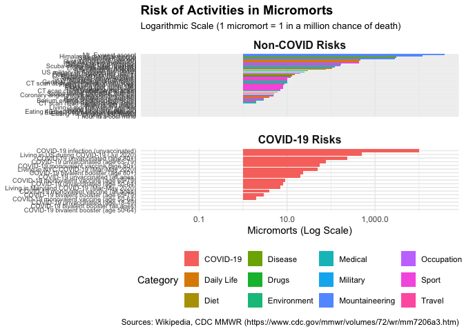

# micromort: Estimate and Visualize Risks


<!-- README.md is generated from README.qmd. Please edit that file -->

# micromort

The goal of `micromort` is to provide tools to quantify, compare, and
visualize risks using standardized units such as **micromorts** (acute
risk of death) and **microlives** (chronic impact on life expectancy).

## Installation

You can install the development version of micromort from
[GitHub](https://github.com/) with:

``` r
# install.packages("devtools")
devtools::install_github("JohnGavin/micromort")
```

### Nix Users

This project provides a reproducible Nix environment.

``` bash
# Enter project shell
./default.sh

# Start R
R
```

## Concepts

- **Micromort:** A one-in-a-million chance of death. Used for acute
  risks (e.g., skydiving).
- **Microlife:** A 30-minute change in life expectancy. Used for chronic
  risks (e.g., smoking).
- **VSL (Value of Statistical Life):** Economic value used to justify
  safety spending.

## Example

### Acute Risks (Micromorts)

How risky is skydiving compared to driving?

``` r
# library(micromort)

# Convert probability to micromorts
as_micromort(1/1000000) # 1 micromort
#> [1] 1

# Common risks
head(common_risks())
#> # A tibble: 6 × 3
#>   activity                risk_micromorts category
#>   <chr>                             <dbl> <chr>   
#> 1 Skydiving (one jump)                7   Sport   
#> 2 Running a marathon                  7   Sport   
#> 3 Scuba diving (per dive)             5   Sport   
#> 4 Skiing (one day)                    0.5 Sport   
#> 5 Motorcycling (60 miles)            10   Travel  
#> 6 Walking (20 miles)                  1   Travel
```

### Visualizing Risks

``` r
plot_risks()
```



### Chronic Risks (Microlives)

How much life expectancy do you lose by smoking?

``` r
# 1 cigarette = approx 1 microlife lost (30 mins)
# Pack a day (20 cigs) = 20 microlives = 10 hours lost per day
daily_loss <- as_microlife(20 * 30)
print(daily_loss)
#> [1] 20
```

## Project Structure

(Tree view requires fs package)
