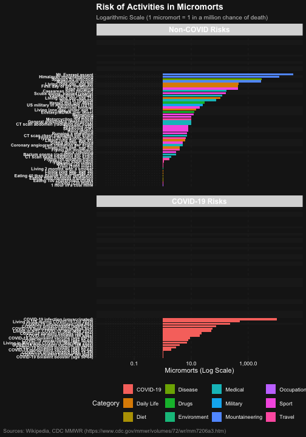

# micromort: Curated Micromort and Microlife Risk Datasets


<!-- README.md is generated from README.qmd. Please edit that file -->

# micromort

A **data package** providing curated datasets of micromort (acute risk)
and microlife (chronic risk) values from authoritative sources including
Wikipedia, CDC MMWR, and academic literature. \## Features

- **62 acute risks** measured in micromorts (one-in-a-million death
  probability per event)
- **35+ chronic factors** measured in microlives (30-minute life
  expectancy change per day)
- **14 authoritative sources** with full provenance tracking
- **Parquet datasets** for cross-language compatibility (R, Python,
  Arrow)
- **Plumber REST API** for programmatic access
- **Interactive dashboard** for data exploration
- **targets pipeline** for reproducible data updates

## Installation

### R-Universe (Recommended)

``` r
# Install from r-universe (pre-built binaries, fast)
install.packages("micromort", repos = "https://johngavin.r-universe.dev")
```

### GitHub

``` r
# Install from GitHub (source)
# install.packages("devtools")
devtools::install_github("JohnGavin/micromort")
```

### Nix Users

This project provides a reproducible Nix environment with pre-built
binaries from the `johngavin` cachix cache:

``` bash
# Enter project shell (uses cachix cache for fast builds)
./default.sh

# Start R
R
```

#### Using with rix

To include micromort in your own Nix-based R project:

``` r
library(rix)

rix(
  r_pkgs = c("dplyr", "ggplot2"),
  git_pkgs = list(
    list(
      package_name = "micromort",
      repo_url = "https://github.com/JohnGavin/micromort",
      commit = "main"  # Or specific SHA for reproducibility
    )
  ),
  project_path = ".",
  overwrite = TRUE
)
```

## Concepts

### Micromort (Acute Risk)

A **micromort** is a unit of mortality risk equal to a
**one-in-a-million probability of death per specific event**.

- **Unit:** 1 micromort = 1/1,000,000 = 0.0001% death probability
- **Scope:** Per discrete event (e.g., one skydive, one surgery, one
  flight)
- **Sign:** Always non-negative (it’s a probability)
- **Example:** Skydiving has ~8 micromorts per jump (8-in-a-million
  death chance per jump)

### Microlife (Chronic Risk)

A **microlife** is a unit of life expectancy change equal to **30
minutes of expected lifespan, measured per day** of exposure.

- **Unit:** 1 microlife = 30 minutes of life expectancy
- **Scope:** Per day of maintaining a habit or exposure
- **Sign:** Positive (life gained) or negative (life lost)
- **Example:** Smoking 2 cigarettes daily costs -1 microlife/day (losing
  30 mins of life expectancy each day you smoke)

### Conversion

**1 micromort ≈ 0.7 microlives** (assuming 40 years remaining life
expectancy)

This allows comparing acute events to chronic habits on a common scale.

### Morbidity Metrics

Micromorts and microlives focus on mortality. For quality-of-life
impacts:

- **QALY (Quality-Adjusted Life Year):** 1 year of perfect health. Used
  in healthcare economics.
- **DALY (Disability-Adjusted Life Years):** Disease burden = YLL + YLD.
- **QALD (Quality-Adjusted Life Days):** 1 day of perfect health. For
  common illnesses.

See the [Introduction
vignette](https://johngavin.github.io/micromort/articles/introduction.html)
for detailed examples.

## Quick Start

### Load the Datasets

``` r
library(micromort)

# Load acute risks (micromorts per event)
acute <- load_acute_risks()
nrow(acute)
#> [1] 62

# Load chronic risks (microlives per day)
chronic <- load_chronic_risks()
nrow(chronic)
#> [1] 22

# Load source registry
sources <- load_sources()
nrow(sources)
#> [1] 14
```

### Acute Risks (Micromorts per Event)

``` r
# Convert a probability to micromorts
# Example: 1 in 10,000 chance = 100 micromorts
as_micromort(1/10000)
#> [1] 100

# Top 10 riskiest activities (micromorts per event/period)
acute |>
  dplyr::select(activity, micromorts, category, period) |>
  head(10)
#> # A tibble: 10 × 4
#>    activity                                micromorts category       period     
#>    <chr>                                        <dbl> <chr>          <chr>      
#>  1 Mt. Everest ascent                           37932 Mountaineering per ascent 
#>  2 Himalayan mountaineering                     12000 Mountaineering per expedi…
#>  3 COVID-19 infection (unvaccinated)            10000 Disease        per infect…
#>  4 Spanish flu infection                         3000 Disease        per infect…
#>  5 Matterhorn ascent                             2840 Mountaineering per ascent 
#>  6 Living in US during COVID-19 (Jul 2020)        500 Disease        per month  
#>  7 Living (one day, age 90)                       463 Daily Life     per day    
#>  8 Base jumping (per jump)                        430 Sport          per event  
#>  9 First day of life (newborn)                    430 Daily Life     per day    
#> 10 COVID-19 unvaccinated (age 80+)                234 COVID-19       11 weeks (…
```

**Caption:** Micromorts represent probability of death per event. Higher
values = higher risk per occurrence.

### Chronic Risks (Microlives per Day)

``` r
# Factors that reduce life expectancy (microlives lost per day)
chronic |>
  dplyr::filter(direction == "loss") |>
  dplyr::select(factor, microlives_per_day, category) |>
  head(10)
#> # A tibble: 10 × 3
#>    factor                   microlives_per_day category    
#>    <chr>                                 <dbl> <chr>       
#>  1 Smoking 20 cigarettes                   -10 Smoking     
#>  2 Smoking 10 cigarettes                    -5 Smoking     
#>  3 Being male (vs female)                   -4 Demographics
#>  4 Being 15 kg overweight                   -3 Weight      
#>  5 Being 10 kg overweight                   -2 Weight      
#>  6 4th-5th alcoholic drink                  -2 Alcohol     
#>  7 Smoking 2 cigarettes                     -1 Smoking     
#>  8 Being 5 kg overweight                    -1 Weight      
#>  9 2nd-3rd alcoholic drink                  -1 Alcohol     
#> 10 Red meat (1 portion/day)                 -1 Diet
```

**Caption:** Microlives per day. Negative values = life expectancy loss;
positive = gain. Effects accumulate daily.

### Visualize Risks

``` r
# Filter to show only activities with micromorts >= 1 for clarity on log scale
plot_risks(common_risks() |> dplyr::filter(micromorts >= 1))
```



## Analysis Functions

### Compare Lifestyle Interventions

``` r
# Compare quitting smoking vs losing weight (microlives gained per day)
compare_interventions(list(
  "Quit 10 cigarettes/day" = list(factor = "Smoking 10 cigarettes", change = -1),
  "Lose 5kg" = list(factor = "Being 5 kg overweight", change = -1)
))
#> # A tibble: 2 × 7
#>   intervention      factor original_ml_per_day change net_ml_per_day annual_days
#>   <chr>             <chr>                <dbl>  <dbl>          <dbl>       <dbl>
#> 1 Quit 10 cigarett… Smoki…                  -5     -1             -5       -38  
#> 2 Lose 5kg          Being…                  -1     -1             -1        -7.6
#> # ℹ 1 more variable: lifetime_years <dbl>
```

### Calculate Baseline Risk by Age

``` r
# Daily baseline mortality risk at age 35 (micromorts per day just from being alive)
daily_hazard_rate(35)
#> # A tibble: 1 × 6
#>     age sex   daily_prob micromorts microlives_consumed interpretation          
#>   <dbl> <chr>      <dbl>      <dbl>               <dbl> <chr>                   
#> 1    35 male  0.00000296          3                0.05 At age 35 (male): 3.0 m…
```

### Lifestyle Tradeoffs

``` r
# How much exercise offsets smoking? (in microlives per day)
lifestyle_tradeoff("Smoking 2 cigarettes", "20 min moderate exercise")
#> # A tibble: 1 × 6
#>   bad_habit            bad_ml_per_day good_habit    good_ml_per_day units_needed
#>   <chr>                         <dbl> <chr>                   <dbl>        <dbl>
#> 1 Smoking 2 cigarettes             -1 20 min moder…               2          0.5
#> # ℹ 1 more variable: interpretation <chr>
```

## API Access

Launch the REST API for programmatic access:

``` r
launch_api()
# API available at http://localhost:8080
# Swagger docs at http://localhost:8080/__docs__/
```

Endpoints: - `GET /v1/acute` - Acute risks dataset (micromorts per
event) - `GET /v1/chronic` - Chronic risks dataset (microlives per
day) - `GET /v1/sources` - Source registry - `GET /v1/hazard?age=35` -
Daily hazard rate (micromorts per day)

## Interactive Dashboard

Launch the Shiny dashboard:

``` r
launch_dashboard()
```

## Data Sources

| Source                   | Type         | Data                         |
|--------------------------|--------------|------------------------------|
| Wikipedia: Micromort     | Encyclopedia | ~50 acute risks              |
| Wikipedia: Microlife     | Encyclopedia | ~20 chronic risks            |
| micromorts.rip           | Database     | ~45 acute risks              |
| CDC MMWR                 | Government   | COVID vaccine data           |
| Spiegelhalter (2012) BMJ | Academic     | Microlife framework          |
| SEER Cancer Statistics   | Government   | Cancer mortality by type/sex |

## Project Structure

<details>

<summary>

Click to expand project tree
</summary>

    #> .
    #> ├── DESCRIPTION
    #> ├── LICENSE
    #> ├── LICENSE.md
    #> ├── NAMESPACE
    #> ├── R
    #> │   ├── api.R
    #> │   ├── dashboard.R
    #> │   ├── data.R
    #> │   ├── dev
    #> │   │   └── verify_pkgdown_urls.R
    #> │   ├── micromort.R
    #> │   ├── models.R
    #> │   ├── risks.R
    #> │   ├── tar_plans
    #> │   │   ├── plan_data_acquisition.R
    #> │   │   ├── plan_documentation.R
    #> │   │   ├── plan_export.R
    #> │   │   ├── plan_logging.R
    #> │   │   ├── plan_normalization.R
    #> │   │   └── plan_validation.R
    #> │   └── visualization.R
    #> ├── README.md
    #> ├── README.qmd
    #> ├── README.rmarkdown
    #> ├── README_files
    #> │   └── libs
    #> │       ├── bootstrap
    #> │       ├── clipboard
    #> │       └── quarto-html
    #> ├── box
    #> │   ├── api
    #> │   │   ├── __init__.R
    #> │   │   └── endpoints.R
    #> │   ├── dashboard
    #> │   │   ├── __init__.R
    #> │   │   ├── server.R
    #> │   │   └── ui.R
    #> │   ├── data
    #> │   │   ├── __init__.R
    #> │   │   ├── loaders.R
    #> │   │   ├── parsers.R
    #> │   │   └── schemas.R
    #> │   └── models
    #> │       ├── __init__.R
    #> │       ├── compare.R
    #> │       └── hazard.R
    #> ├── data-raw
    #> │   ├── 01_extract_current_data.R
    #> │   └── sources
    #> │       ├── acute_risks_base.csv
    #> │       ├── chronic_risks_base.csv
    #> │       ├── covid_vaccine_rr.csv
    #> │       ├── demographic_factors.csv
    #> │       └── risk_sources.csv
    #> ├── default.R
    #> ├── default.nix
    #> ├── default.sh
    #> ├── docs
    #> │   ├── 404.html
    #> │   ├── 404.md
    #> │   ├── LICENSE-text.html
    #> │   ├── LICENSE-text.md
    #> │   ├── LICENSE.html
    #> │   ├── LICENSE.md
    #> │   ├── articles
    #> │   │   ├── index.html
    #> │   │   ├── index.md
    #> │   │   ├── introduction.html
    #> │   │   ├── introduction.md
    #> │   │   ├── introduction_files
    #> │   │   ├── palatable_units.html
    #> │   │   ├── palatable_units.md
    #> │   │   └── palatable_units_files
    #> │   ├── authors.html
    #> │   ├── authors.md
    #> │   ├── deps
    #> │   │   ├── bootstrap-5.3.1
    #> │   │   ├── bootstrap-toc-1.0.1
    #> │   │   ├── clipboard.js-2.0.11
    #> │   │   ├── data-deps.txt
    #> │   │   ├── font-awesome-6.5.2
    #> │   │   ├── headroom-0.11.0
    #> │   │   ├── jquery-3.6.0
    #> │   │   └── search-1.0.0
    #> │   ├── index.html
    #> │   ├── index.md
    #> │   ├── katex-auto.js
    #> │   ├── lightswitch.js
    #> │   ├── link.svg
    #> │   ├── llms.txt
    #> │   ├── news
    #> │   ├── pkgdown.js
    #> │   ├── pkgdown.yml
    #> │   ├── reference
    #> │   │   ├── acute_risks.html
    #> │   │   ├── acute_risks.md
    #> │   │   ├── annual_risk_budget.html
    #> │   │   ├── annual_risk_budget.md
    #> │   │   ├── as_microlife.html
    #> │   │   ├── as_microlife.md
    #> │   │   ├── as_micromort.html
    #> │   │   ├── as_micromort.md
    #> │   │   ├── as_probability.html
    #> │   │   ├── as_probability.md
    #> │   │   ├── cancer_risks.html
    #> │   │   ├── cancer_risks.md
    #> │   │   ├── chronic_risks.html
    #> │   │   ├── chronic_risks.md
    #> │   │   ├── common_risks.html
    #> │   │   ├── common_risks.md
    #> │   │   ├── compare_interventions.html
    #> │   │   ├── compare_interventions.md
    #> │   │   ├── conditional_risk.html
    #> │   │   ├── conditional_risk.md
    #> │   │   ├── covid_vaccine_rr.html
    #> │   │   ├── covid_vaccine_rr.md
    #> │   │   ├── daily_hazard_rate.html
    #> │   │   ├── daily_hazard_rate.md
    #> │   │   ├── demographic_factors.html
    #> │   │   ├── demographic_factors.md
    #> │   │   ├── figures
    #> │   │   ├── hedged_portfolio.html
    #> │   │   ├── hedged_portfolio.md
    #> │   │   ├── index.html
    #> │   │   ├── index.md
    #> │   │   ├── launch_api.html
    #> │   │   ├── launch_api.md
    #> │   │   ├── launch_dashboard.html
    #> │   │   ├── launch_dashboard.md
    #> │   │   ├── libs
    #> │   │   ├── lifestyle_tradeoff.html
    #> │   │   ├── lifestyle_tradeoff.md
    #> │   │   ├── lle.html
    #> │   │   ├── lle.md
    #> │   │   ├── load_acute_risks.html
    #> │   │   ├── load_acute_risks.md
    #> │   │   ├── load_chronic_risks.html
    #> │   │   ├── load_chronic_risks.md
    #> │   │   ├── load_sources.html
    #> │   │   ├── load_sources.md
    #> │   │   ├── plot_risks-1.png
    #> │   │   ├── plot_risks-2.png
    #> │   │   ├── plot_risks.html
    #> │   │   ├── plot_risks.md
    #> │   │   ├── plot_risks_interactive.html
    #> │   │   ├── plot_risks_interactive.md
    #> │   │   ├── risk_data_sources.html
    #> │   │   ├── risk_data_sources.md
    #> │   │   ├── risk_sources.html
    #> │   │   ├── risk_sources.md
    #> │   │   ├── vaccination_risks.html
    #> │   │   ├── vaccination_risks.md
    #> │   │   ├── value_of_micromort.html
    #> │   │   └── value_of_micromort.md
    #> │   ├── search.json
    #> │   ├── sitemap.xml
    #> │   └── tutorials
    #> ├── inst
    #> │   ├── dashboard
    #> │   │   └── about.md
    #> │   ├── extdata
    #> │   │   ├── acute_risks.parquet
    #> │   │   ├── chronic_risks.parquet
    #> │   │   ├── logs
    #> │   │   └── risk_sources.parquet
    #> │   └── plumber
    #> │       └── api.R
    #> ├── man
    #> │   ├── acute_risks.Rd
    #> │   ├── annual_risk_budget.Rd
    #> │   ├── as_microlife.Rd
    #> │   ├── as_micromort.Rd
    #> │   ├── as_probability.Rd
    #> │   ├── cancer_risks.Rd
    #> │   ├── chronic_risks.Rd
    #> │   ├── common_risks.Rd
    #> │   ├── compare_interventions.Rd
    #> │   ├── conditional_risk.Rd
    #> │   ├── covid_vaccine_rr.Rd
    #> │   ├── daily_hazard_rate.Rd
    #> │   ├── demographic_factors.Rd
    #> │   ├── figures
    #> │   │   └── README-plot-1.png
    #> │   ├── hedged_portfolio.Rd
    #> │   ├── launch_api.Rd
    #> │   ├── launch_dashboard.Rd
    #> │   ├── lifestyle_tradeoff.Rd
    #> │   ├── lle.Rd
    #> │   ├── load_acute_risks.Rd
    #> │   ├── load_chronic_risks.Rd
    #> │   ├── load_sources.Rd
    #> │   ├── plot_risks.Rd
    #> │   ├── plot_risks_interactive.Rd
    #> │   ├── risk_data_sources.Rd
    #> │   ├── risk_sources.Rd
    #> │   ├── vaccination_risks.Rd
    #> │   └── value_of_micromort.Rd
    #> ├── nix-shell-root
    #> ├── push_to_cachix.sh
    #> ├── tests
    #> │   └── testthat
    #> │       └── test-adversarial.R
    #> └── vignettes
    #>     ├── introduction.Rmd
    #>     └── palatable_units.Rmd

</details>

## Contributing

Contributions are welcome! Please:

1.  **Report issues** at [GitHub
    Issues](https://github.com/JohnGavin/micromort/issues)
2.  **Submit PRs** following the [tidyverse style
    guide](https://style.tidyverse.org/)
3.  **Add data** - New risk sources welcome! Include:
    - Source URL with citation
    - Units (micromorts per event OR microlives per day)
    - Period specification (per jump, per day, per year, etc.)

### Development Setup

``` bash
# Clone and enter Nix environment
git clone https://github.com/JohnGavin/micromort.git
cd micromort
./default.sh

# Run tests
Rscript -e "devtools::test()"

# Check package
Rscript -e "devtools::check()"
```

## References

- Howard RA (1980). “On Making Life and Death Decisions.” *Societal Risk
  Assessment*.
- Spiegelhalter D (2012). “Using speed of ageing and ‘microlives’.” BMJ
  345:e8223. [DOI: 10.1136/bmj.e8223](https://doi.org/10.1136/bmj.e8223)
- Blastland M, Spiegelhalter D (2013). *The Norm Chronicles: Stories and
  Numbers About Danger*.

## License

MIT © [John Gavin](https://github.com/JohnGavin)

See [LICENSE](LICENSE) for details.
