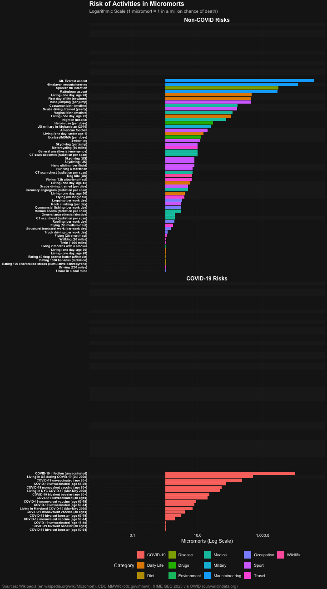

<!-- README.md is generated from README.qmd. Please edit that file -->


# micromort 

A **data package** providing curated, cross-sectional snapshots of micromort (acute risk) and microlife (chronic risk) values from authoritative sources including Wikipedia, CDC MMWR, and academic literature. This is a reference dataset for risk comparison and communication — not a time-series analysis tool or epidemiological modelling framework.

## Features

- **62 acute risks** measured in micromorts (one-in-a-million death probability per event)
- **35+ chronic factors** measured in microlives (30-minute life expectancy change per day)
- **14 authoritative sources** with full provenance tracking
- **Parquet datasets** for cross-language compatibility (R, Python, Arrow)
- **Plumber REST API** for programmatic access
- **Interactive dashboard** for data exploration
- **targets pipeline** for reproducible data updates

## Architecture

<details>
<summary>Package architecture diagram (click to expand; renders on GitHub)</summary>


```mermaid
%%{init: {'theme': 'dark', 'themeVariables': {'primaryColor': '#999999', 'primaryTextColor': '#000000', 'primaryBorderColor': '#CC0000', 'lineColor': '#CC0000', 'secondaryColor': '#999999', 'tertiaryColor': '#999999', 'background': '#000000', 'mainBkg': '#999999', 'nodeBorder': '#CC0000', 'clusterBkg': '#333333', 'clusterBorder': '#CC0000', 'titleColor': '#000000', 'edgeLabelBackground': '#999999'}}}%%
graph LR

  Conversion["Unit Conversion<br>5 functions"]
  Data["Risk Datasets<br>21 functions"]
  Analysis["Risk Analysis<br>6 functions"]
  Viz["Visualization<br>5 functions"]
  Apps["Interactive Apps<br>6 functions"]

  Conversion --> Data --> Analysis --> Viz --> Apps

  style Conversion fill:#999999,stroke:#CC0000,color:#000000
  style Data fill:#999999,stroke:#CC0000,color:#000000
  style Analysis fill:#999999,stroke:#CC0000,color:#000000
  style Viz fill:#999999,stroke:#CC0000,color:#000000
  style Apps fill:#999999,stroke:#CC0000,color:#000000
```

</details>

See the [Architecture vignette](https://johngavin.github.io/micromort/articles/architecture.html) for detailed package diagrams.

See the [Architecture vignette](https://johngavin.github.io/micromort/articles/architecture.html)
for detailed diagrams of the data pipeline, function hierarchy, and user journey.

## Installation

### R-Universe (Recommended)

```r
# Install from r-universe (pre-built binaries, fast)
install.packages("micromort", repos = "https://johngavin.r-universe.dev")
```

### GitHub

```r
# Install from GitHub (source)
# install.packages("devtools")
devtools::install_github("JohnGavin/micromort")
```

### Nix Users

This project provides a reproducible Nix environment with pre-built binaries from the `johngavin` cachix cache:

```bash
# Enter project shell (uses cachix cache for fast builds)
./default.sh

# Start R
R
```

#### Using with rix

To include micromort in your own Nix-based R project:

```r
library(rix)

rix(
  r_pkgs = c("dplyr", "ggplot2"),
  git_pkgs = list(
    list(
      package_name = "micromort",
      repo_url = "https://github.com/JohnGavin/micromort",
      commit = "main"  # Or specific SHA for reproducibility
    )
  ),
  project_path = ".",
  overwrite = TRUE
)
```

## Concepts

### Micromort (Acute Risk)
A **micromort** is a unit of mortality risk equal to a **one-in-a-million probability of death per specific event**.

- **Unit:** 1 micromort = 1/1,000,000 = 0.0001% death probability
- **Scope:** Per discrete event (e.g., one skydive, one surgery, one flight)
- **Sign:** Always non-negative (it's a probability)
- **Example:** Skydiving has ~8 micromorts per jump (8-in-a-million death chance per jump)

### Microlife (Chronic Risk)

A **microlife** is a unit of life expectancy change equal to **30 minutes of expected lifespan, measured per day** of exposure.

- **Unit:** 1 microlife = 30 minutes of life expectancy
- **Scope:** Per day of maintaining a habit or exposure
- **Sign:** Positive (life gained) or negative (life lost)
- **Example:** Smoking 2 cigarettes daily costs -1 microlife/day (losing 30 mins of life expectancy each day you smoke)

### Conversion {#conversion}

**1 micromort ≈ 0.7 microlives** (assuming 40 years remaining life expectancy).
The conversion scales linearly with remaining life expectancy:

| Remaining life expectancy | 1 micromort ≈ |
|---------------------------|---------------|
| 10 years | 0.18 microlives |
| 20 years | 0.35 microlives |
| 40 years (default) | 0.70 microlives |
| 60 years | 1.05 microlives |

Use `lle(prob, life_expectancy = ...)` and `as_microlife()` to convert at any age.
See the [Age-Based Hazard Rates](#calculate-baseline-risk-by-age) section for daily micromort exposure by age.

### Morbidity Metrics

Micromorts and microlives focus on mortality. For quality-of-life impacts:

- **QALY (Quality-Adjusted Life Year):** 1 year of perfect health. Used in healthcare economics.
- **DALY (Disability-Adjusted Life Years):** Disease burden combining:
    - **YLL (Years of Life Lost):** Premature mortality component
    - **YLD (Years Lived with Disability):** Morbidity component
- **QALD (Quality-Adjusted Life Days):** 1 day of perfect health. For common illnesses.

See the [Introduction vignette](https://johngavin.github.io/micromort/articles/introduction.html) for detailed examples and the [Glossary](#glossary) for all acronym definitions.

## Quick Start

### Load the Datasets


``` r
library(micromort)

# Load acute risks (micromorts per event)
acute <- load_acute_risks()
nrow(acute)
#> [1] 104

# Load chronic risks (microlives per day)
chronic <- load_chronic_risks()
nrow(chronic)
#> [1] 38

# Load source registry
sources <- load_sources()
nrow(sources)
#> [1] 14
```

### Acute Risks (Micromorts per Event)


``` r
# Convert a probability to micromorts
# Example: 1 in 10,000 chance = 100 micromorts
as_micromort(1/10000)
#> [1] 100

# Top 10 riskiest activities (micromorts per event/period)
acute |>
  dplyr::select(activity, micromorts, category, period) |>
  head(10)
#> # A tibble: 10 × 4
#>    activity                                micromorts category       period     
#>    <chr>                                        <dbl> <chr>          <chr>      
#>  1 Mt. Everest ascent                           37932 Mountaineering per ascent 
#>  2 Himalayan mountaineering                     12000 Mountaineering per expedi…
#>  3 COVID-19 infection (unvaccinated)            10000 COVID-19       per infect…
#>  4 Spanish flu infection                         3000 Disease        per infect…
#>  5 Matterhorn ascent                             2840 Mountaineering per ascent 
#>  6 Living in US during COVID-19 (Jul 2020)        500 COVID-19       per month  
#>  7 Living (one day, age 90)                       463 Daily Life     per day    
#>  8 Base jumping (per jump)                        430 Sport          per jump   
#>  9 First day of life (newborn)                    430 Daily Life     per day    
#> 10 COVID-19 unvaccinated (age 80+)                234 COVID-19       11 weeks (…
```

**Caption:** Micromorts represent probability of death per event. Higher values = higher risk per occurrence.

### Chronic Risks (Microlives per Day)


``` r
# Factors that reduce life expectancy (microlives lost per day)
chronic |>
  dplyr::filter(direction == "loss") |>
  dplyr::select(factor, microlives_per_day, category) |>
  head(10)
#> # A tibble: 10 × 3
#>    factor                              microlives_per_day category      
#>    <chr>                                            <dbl> <chr>         
#>  1 Smoking 20 cigarettes                              -10 Smoking       
#>  2 Smoking 10 cigarettes                               -5 Smoking       
#>  3 Untreated hypertension                              -4 Cardiovascular
#>  4 Being male (vs female)                              -4 Demographics  
#>  5 Being 15 kg overweight                              -3 Weight        
#>  6 Type 2 diabetes (poorly controlled)                 -3 Cardiovascular
#>  7 Being 10 kg overweight                              -2 Weight        
#>  8 4th-5th alcoholic drink                             -2 Alcohol       
#>  9 Sitting 8+ hours/day                                -2 Sedentary     
#> 10 High LDL cholesterol (untreated)                    -2 Cardiovascular
```

**Caption:** Microlives per day. Negative values = life expectancy loss; positive = gain. Effects accumulate daily.

### Visualize Risks


``` r
# Filter to show only activities with micromorts >= 1 for clarity on log scale
plot_risks(common_risks() |> dplyr::filter(micromorts >= 1))
```

<div class="figure">

<p class="caption">Risk comparison in micromorts (log scale). Bars show death probability per event. COVID-19 and other risks shown in separate panels for clarity.</p>
</div>

## Analysis Functions

### Compare Lifestyle Interventions


``` r
# Compare quitting smoking vs losing weight (microlives gained per day)
compare_interventions(list(
  "Quit 10 cigarettes/day" = list(factor = "Smoking 10 cigarettes", change = -1),
  "Lose 5kg" = list(factor = "Being 5 kg overweight", change = -1)
))
#> # A tibble: 2 × 7
#>   intervention      factor original_ml_per_day change net_ml_per_day annual_days
#>   <chr>             <chr>                <dbl>  <dbl>          <dbl>       <dbl>
#> 1 Quit 10 cigarett… Smoki…                  -5     -1             -5       -38  
#> 2 Lose 5kg          Being…                  -1     -1             -1        -7.6
#> # ℹ 1 more variable: lifetime_years <dbl>
```

### Calculate Baseline Risk by Age


``` r
# Daily baseline mortality risk at age 35 (micromorts per day just from being alive)
daily_hazard_rate(35)
#> # A tibble: 1 × 7
#>     age sex   daily_prob micromorts microlives_consumed precision_note          
#>   <dbl> <chr>      <dbl>      <dbl>               <dbl> <chr>                   
#> 1    35 male  0.00000296          3                 0.1 Gompertz-Makeham approx…
#> # ℹ 1 more variable: interpretation <chr>
```

### Lifestyle Tradeoffs


``` r
# How much exercise offsets smoking? (in microlives per day)
lifestyle_tradeoff("Smoking 2 cigarettes", "20 min moderate exercise")
#> # A tibble: 1 × 6
#>   bad_habit            bad_ml_per_day good_habit    good_ml_per_day units_needed
#>   <chr>                         <dbl> <chr>                   <dbl>        <dbl>
#> 1 Smoking 2 cigarettes             -1 20 min moder…               2          0.5
#> # ℹ 1 more variable: interpretation <chr>
```

## API Access

Launch the REST API for programmatic access:

```r
launch_api()
# API available at http://localhost:8080
# Swagger docs at http://localhost:8080/__docs__/
```

**Core endpoints** (30 total — see [REST API vignette](https://johngavin.github.io/micromort/articles/rest_api.html) for full reference):

- `GET /v1/risks/acute` — Acute risks (micromorts per event)
- `GET /v1/risks/chronic` — Chronic risks (microlives per day)
- `GET /v1/risks/cancer` — Cancer mortality by type/sex/age
- `GET /v1/analysis/equivalence` — Risk equivalence lookup
- `GET /v1/convert/hazard-rate?age=35` — Daily hazard rate
- `GET /v1/sources` — Source registry
- `GET /health` — Health check

## Interactive Dashboard

Launch the Shiny dashboard:

```r
launch_dashboard()
```

## Risk Quizzes

| Quiz | Play in browser | Local |
|------|----------------|-------|
| Which Is Riskier? | [Shinylive](https://johngavin.github.io/micromort/articles/quiz_shinylive.html) | `launch_quiz()` |
| Microlife Quiz | [Shinylive](https://johngavin.github.io/micromort/articles/chronic_quiz_shinylive.html) | `launch_chronic_quiz()` |
| Rank the Risks | [Shinylive](https://johngavin.github.io/micromort/articles/ranking_quiz_shinylive.html) | — |

All Shinylive quizzes run via WebR in the browser (30-60s initial load).

Generate geography-specific quiz pairs comparing disease risk across countries:

```r
geography_quiz_pairs(countries = c("UK", "NG"), seed = 42)
```

## Data Sources

| Source | Type | Data |
|--------|------|------|
| Wikipedia: Micromort | Encyclopedia | ~50 acute risks |
| Wikipedia: Microlife | Encyclopedia | ~20 chronic risks |
| micromorts.rip | Database | ~45 acute risks |
| CDC MMWR | Government | COVID vaccine data |
| Spiegelhalter (2012) BMJ | Academic | Microlife framework |
| SEER Cancer Statistics | Government | Cancer mortality by type/sex |
| IHME GBD 2023 via OWID | Academic | Disease + risk-factor mortality by country |

## Project Structure

<details>
<summary>Click to expand project tree</summary>


```
#> .
#> ├── CLAUDE.md
#> ├── DESCRIPTION
#> ├── LICENSE
#> ├── LICENSE.md
#> ├── NAMESPACE
#> ├── R
#> │   ├── activity_descriptions.R
#> │   ├── api.R
#> │   ├── atomic_risks.R
#> │   ├── dashboard.R
#> │   ├── data.R
#> │   ├── dev
#> │   │   ├── issues
#> │   │   └── verify_pkgdown_urls.R
#> │   ├── diagrams.R
#> │   ├── factor_descriptions.R
#> │   ├── micromort.R
#> │   ├── models.R
#> │   ├── quiz.R
#> │   ├── radiation_profiles.R
#> │   ├── ranking_quiz.R
#> │   ├── regional.R
#> │   ├── risk_equivalence.R
#> │   ├── risks.R
#> │   ├── tar_plans
#> │   │   ├── plan_data_acquisition.R
#> │   │   ├── plan_documentation.R
#> │   │   ├── plan_export.R
#> │   │   ├── plan_leaderboard_stats.R
#> │   │   ├── plan_logging.R
#> │   │   ├── plan_normalization.R
#> │   │   ├── plan_pkgctx.R
#> │   │   ├── plan_pkgdown.R
#> │   │   ├── plan_qa_gates.R
#> │   │   ├── plan_site_build.R
#> │   │   ├── plan_telemetry.R
#> │   │   ├── plan_validation.R
#> │   │   └── plan_vignette_outputs.R
#> │   └── visualization.R
#> ├── README.md
#> ├── README.qmd
#> ├── README_files
#> │   └── libs
#> │       ├── bootstrap
#> │       ├── clipboard
#> │       └── quarto-html
#> ├── box
#> │   ├── api
#> │   │   ├── __init__.R
#> │   │   └── endpoints.R
#> │   ├── dashboard
#> │   │   ├── __init__.R
#> │   │   ├── server.R
#> │   │   └── ui.R
#> │   ├── data
#> │   │   ├── __init__.R
#> │   │   ├── loaders.R
#> │   │   ├── parsers.R
#> │   │   └── schemas.R
#> │   └── models
#> │       ├── __init__.R
#> │       ├── compare.R
#> │       └── hazard.R
#> ├── check
#> │   ├── micromort.Rcheck
#> │   │   ├── 00_pkg_src
#> │   │   ├── 00check.log
#> │   │   ├── 00install.out
#> │   │   ├── R_check_bin
#> │   │   ├── micromort
#> │   │   ├── micromort-Ex.R
#> │   │   ├── micromort-Ex.Rout
#> │   │   ├── micromort-Ex.pdf
#> │   │   └── micromort-Ex.timings
#> │   └── micromort_0.1.0.tar.gz
#> ├── data-raw
#> │   ├── 01_extract_current_data.R
#> │   ├── 02_regional_life_expectancy.R
#> │   ├── 02_regional_life_expectancy_sample.R
#> │   ├── 03_osha_occupational_risks.R
#> │   ├── 04_road_traffic_mortality.R
#> │   ├── 05_global_homicide_rates.R
#> │   ├── README_regional_data.md
#> │   ├── generate_og_image.R
#> │   ├── generate_quiz_csv.R
#> │   └── sources
#> │       ├── acute_risks_base.csv
#> │       ├── chronic_risks_base.csv
#> │       ├── covid_vaccine_rr.csv
#> │       ├── demographic_factors.csv
#> │       └── risk_sources.csv
#> ├── default.R
#> ├── default.nix
#> ├── default.sh
#> ├── docs
#> │   ├── 404.html
#> │   ├── 404.md
#> │   ├── CLAUDE.html
#> │   ├── CLAUDE.md
#> │   ├── LICENSE-text.html
#> │   ├── LICENSE-text.md
#> │   ├── LICENSE.html
#> │   ├── LICENSE.md
#> │   ├── api
#> │   │   └── quiz_stats.json
#> │   ├── apple-touch-icon.png
#> │   ├── articles
#> │   │   ├── _extensions
#> │   │   ├── architecture.html
#> │   │   ├── architecture.md
#> │   │   ├── architecture_files
#> │   │   ├── chronic_quiz_shinylive.html
#> │   │   ├── chronic_quiz_shinylive.md
#> │   │   ├── chronic_quiz_shinylive_files
#> │   │   ├── chronic_vs_acute.html
#> │   │   ├── chronic_vs_acute.md
#> │   │   ├── chronic_vs_acute_files
#> │   │   ├── closeread-standalone.css
#> │   │   ├── confounding.html
#> │   │   ├── confounding.md
#> │   │   ├── confounding_files
#> │   │   ├── data_reliability.html
#> │   │   ├── data_reliability.md
#> │   │   ├── data_reliability_files
#> │   │   ├── index.html
#> │   │   ├── index.md
#> │   │   ├── introduction.html
#> │   │   ├── introduction.md
#> │   │   ├── introduction_files
#> │   │   ├── microlife-quiz.html
#> │   │   ├── microlife-quiz.md
#> │   │   ├── microlife-quiz_files
#> │   │   ├── micromort-quiz.html
#> │   │   ├── micromort-quiz.md
#> │   │   ├── micromort-quiz_files
#> │   │   ├── palatable_units.html
#> │   │   ├── palatable_units.md
#> │   │   ├── palatable_units_files
#> │   │   ├── quiz_shinylive.html
#> │   │   ├── quiz_shinylive.md
#> │   │   ├── quiz_shinylive_files
#> │   │   ├── ranking_quiz_shinylive.html
#> │   │   ├── ranking_quiz_shinylive.md
#> │   │   ├── ranking_quiz_shinylive_files
#> │   │   ├── regional_variation.html
#> │   │   ├── regional_variation.md
#> │   │   ├── regional_variation_files
#> │   │   ├── rest_api.html
#> │   │   ├── rest_api.md
#> │   │   ├── rest_api_files
#> │   │   ├── risk-ranking-quiz.html
#> │   │   ├── risk-ranking-quiz.md
#> │   │   ├── risk-ranking-quiz_files
#> │   │   ├── risk_equivalence.html
#> │   │   ├── risk_equivalence.md
#> │   │   ├── risk_equivalence_files
#> │   │   ├── shinylive-sw.js
#> │   │   ├── telemetry.html
#> │   │   ├── telemetry.md
#> │   │   ├── telemetry_files
#> │   │   ├── what-is-a-micromort.html
#> │   │   ├── what-is-a-micromort.md
#> │   │   └── what-is-a-micromort_files
#> │   ├── authors.html
#> │   ├── authors.md
#> │   ├── deps
#> │   │   ├── bootstrap-5.3.1
#> │   │   ├── bootstrap-toc-1.0.1
#> │   │   ├── clipboard.js-2.0.11
#> │   │   ├── data-deps.txt
#> │   │   ├── font-awesome-6.5.2
#> │   │   ├── headroom-0.11.0
#> │   │   ├── jquery-3.6.0
#> │   │   └── search-1.0.0
#> │   ├── extra.css
#> │   ├── extra.js
#> │   ├── favicon-96x96.png
#> │   ├── favicon.ico
#> │   ├── favicon.svg
#> │   ├── index.html
#> │   ├── index.md
#> │   ├── katex-auto.js
#> │   ├── lightswitch.js
#> │   ├── link.svg
#> │   ├── llms.txt
#> │   ├── logo.png
#> │   ├── news
#> │   ├── pkgdown.js
#> │   ├── pkgdown.yml
#> │   ├── reference
#> │   │   ├── activity_descriptions.html
#> │   │   ├── activity_descriptions.md
#> │   │   ├── acute_risks.html
#> │   │   ├── acute_risks.md
#> │   │   ├── annual_risk_budget.html
#> │   │   ├── annual_risk_budget.md
#> │   │   ├── as_microlife.html
#> │   │   ├── as_microlife.md
#> │   │   ├── as_micromort.html
#> │   │   ├── as_micromort.md
#> │   │   ├── as_probability.html
#> │   │   ├── as_probability.md
#> │   │   ├── atomic_risks.html
#> │   │   ├── atomic_risks.md
#> │   │   ├── cancer_risks.html
#> │   │   ├── cancer_risks.md
#> │   │   ├── chronic_quiz_pairs.html
#> │   │   ├── chronic_quiz_pairs.md
#> │   │   ├── chronic_risks.html
#> │   │   ├── chronic_risks.md
#> │   │   ├── common_risks.html
#> │   │   ├── common_risks.md
#> │   │   ├── compare_interventions.html
#> │   │   ├── compare_interventions.md
#> │   │   ├── conditional_risk.html
#> │   │   ├── conditional_risk.md
#> │   │   ├── covid_vaccine_rr.html
#> │   │   ├── covid_vaccine_rr.md
#> │   │   ├── daily_hazard_rate.html
#> │   │   ├── daily_hazard_rate.md
#> │   │   ├── demographic_factors.html
#> │   │   ├── demographic_factors.md
#> │   │   ├── factor_descriptions.html
#> │   │   ├── factor_descriptions.md
#> │   │   ├── figures
#> │   │   ├── format_activity_name.html
#> │   │   ├── format_activity_name.md
#> │   │   ├── geography_quiz_pairs.html
#> │   │   ├── geography_quiz_pairs.md
#> │   │   ├── hedged_portfolio.html
#> │   │   ├── hedged_portfolio.md
#> │   │   ├── index.html
#> │   │   ├── index.md
#> │   │   ├── kendall_tau_score.html
#> │   │   ├── kendall_tau_score.md
#> │   │   ├── laggard_regions.html
#> │   │   ├── laggard_regions.md
#> │   │   ├── launch_api.html
#> │   │   ├── launch_api.md
#> │   │   ├── launch_chronic_quiz.html
#> │   │   ├── launch_chronic_quiz.md
#> │   │   ├── launch_dashboard.html
#> │   │   ├── launch_dashboard.md
#> │   │   ├── launch_quiz.html
#> │   │   ├── launch_quiz.md
#> │   │   ├── libs
#> │   │   ├── lifestyle_tradeoff.html
#> │   │   ├── lifestyle_tradeoff.md
#> │   │   ├── lle.html
#> │   │   ├── lle.md
#> │   │   ├── load_acute_risks.html
#> │   │   ├── load_acute_risks.md
#> │   │   ├── load_chronic_risks.html
#> │   │   ├── load_chronic_risks.md
#> │   │   ├── load_sources.html
#> │   │   ├── load_sources.md
#> │   │   ├── patient_radiation_comparison.html
#> │   │   ├── patient_radiation_comparison.md
#> │   │   ├── plot_risk_components-1.png
#> │   │   ├── plot_risk_components.html
#> │   │   ├── plot_risk_components.md
#> │   │   ├── plot_risks-1.png
#> │   │   ├── plot_risks-2.png
#> │   │   ├── plot_risks-3.png
#> │   │   ├── plot_risks-4.png
#> │   │   ├── plot_risks-5.png
#> │   │   ├── plot_risks.html
#> │   │   ├── plot_risks.md
#> │   │   ├── plot_risks_interactive.html
#> │   │   ├── plot_risks_interactive.md
#> │   │   ├── prepare_risks_plot-1.png
#> │   │   ├── prepare_risks_plot.html
#> │   │   ├── prepare_risks_plot.md
#> │   │   ├── quiz_pairs.html
#> │   │   ├── quiz_pairs.md
#> │   │   ├── radiation_profiles.html
#> │   │   ├── radiation_profiles.md
#> │   │   ├── ranking_quiz_questions.html
#> │   │   ├── ranking_quiz_questions.md
#> │   │   ├── ranking_tag_mapping.html
#> │   │   ├── ranking_tag_mapping.md
#> │   │   ├── regional_life_expectancy.html
#> │   │   ├── regional_life_expectancy.md
#> │   │   ├── regional_mortality_multiplier.html
#> │   │   ├── regional_mortality_multiplier.md
#> │   │   ├── risk_components.html
#> │   │   ├── risk_components.md
#> │   │   ├── risk_data_sources.html
#> │   │   ├── risk_data_sources.md
#> │   │   ├── risk_equivalence.html
#> │   │   ├── risk_equivalence.md
#> │   │   ├── risk_exchange_matrix.html
#> │   │   ├── risk_exchange_matrix.md
#> │   │   ├── risk_for_duration.html
#> │   │   ├── risk_for_duration.md
#> │   │   ├── risk_sources.html
#> │   │   ├── risk_sources.md
#> │   │   ├── theme_micromort_dark-1.png
#> │   │   ├── theme_micromort_dark.html
#> │   │   ├── theme_micromort_dark.md
#> │   │   ├── vaccination_risks.html
#> │   │   ├── vaccination_risks.md
#> │   │   ├── value_of_micromort.html
#> │   │   ├── value_of_micromort.md
#> │   │   ├── vanguard_regions.html
#> │   │   └── vanguard_regions.md
#> │   ├── search.json
#> │   ├── site.webmanifest
#> │   ├── sitemap.xml
#> │   ├── tutorials
#> │   ├── web-app-manifest-192x192.png
#> │   └── web-app-manifest-512x512.png
#> ├── inst
#> │   ├── dashboard
#> │   │   └── about.md
#> │   ├── extdata
#> │   │   ├── acute_risks.parquet
#> │   │   ├── chronic_risks.parquet
#> │   │   ├── logs
#> │   │   ├── regional_life_expectancy.parquet
#> │   │   ├── risk_sources.parquet
#> │   │   └── vignettes
#> │   └── plumber
#> │       └── api.R
#> ├── man
#> │   ├── activity_descriptions.Rd
#> │   ├── acute_risks.Rd
#> │   ├── annual_risk_budget.Rd
#> │   ├── as_microlife.Rd
#> │   ├── as_micromort.Rd
#> │   ├── as_probability.Rd
#> │   ├── atomic_risks.Rd
#> │   ├── cancer_risks.Rd
#> │   ├── chronic_quiz_pairs.Rd
#> │   ├── chronic_risks.Rd
#> │   ├── common_risks.Rd
#> │   ├── compare_interventions.Rd
#> │   ├── conditional_risk.Rd
#> │   ├── covid_vaccine_rr.Rd
#> │   ├── daily_hazard_rate.Rd
#> │   ├── demographic_factors.Rd
#> │   ├── factor_descriptions.Rd
#> │   ├── figures
#> │   │   ├── README-plot-1.png
#> │   │   ├── logo-candidates
#> │   │   ├── logo.png
#> │   │   └── og-image.png
#> │   ├── format_activity_name.Rd
#> │   ├── geography_quiz_pairs.Rd
#> │   ├── hedged_portfolio.Rd
#> │   ├── kendall_tau_score.Rd
#> │   ├── laggard_regions.Rd
#> │   ├── launch_api.Rd
#> │   ├── launch_chronic_quiz.Rd
#> │   ├── launch_dashboard.Rd
#> │   ├── launch_quiz.Rd
#> │   ├── lifestyle_tradeoff.Rd
#> │   ├── lle.Rd
#> │   ├── load_acute_risks.Rd
#> │   ├── load_chronic_risks.Rd
#> │   ├── load_sources.Rd
#> │   ├── patient_radiation_comparison.Rd
#> │   ├── plot_risk_components.Rd
#> │   ├── plot_risks.Rd
#> │   ├── plot_risks_interactive.Rd
#> │   ├── prepare_risks_plot.Rd
#> │   ├── quiz_pairs.Rd
#> │   ├── radiation_profiles.Rd
#> │   ├── ranking_quiz_questions.Rd
#> │   ├── ranking_tag_mapping.Rd
#> │   ├── regional_life_expectancy.Rd
#> │   ├── regional_mortality_multiplier.Rd
#> │   ├── risk_components.Rd
#> │   ├── risk_data_sources.Rd
#> │   ├── risk_equivalence.Rd
#> │   ├── risk_exchange_matrix.Rd
#> │   ├── risk_for_duration.Rd
#> │   ├── risk_sources.Rd
#> │   ├── theme_micromort_dark.Rd
#> │   ├── vaccination_risks.Rd
#> │   ├── value_of_micromort.Rd
#> │   └── vanguard_regions.Rd
#> ├── nix-shell-root
#> ├── package.nix
#> ├── pkgdown
#> │   ├── extra.css
#> │   ├── extra.js
#> │   └── favicon
#> │       ├── apple-touch-icon.png
#> │       ├── favicon-96x96.png
#> │       ├── favicon.ico
#> │       ├── favicon.svg
#> │       ├── site.webmanifest
#> │       ├── web-app-manifest-192x192.png
#> │       └── web-app-manifest-512x512.png
#> ├── plans
#> │   ├── PLAN_consistency_refactor.md
#> │   ├── PLAN_regional_longevity.md
#> │   ├── PLAN_risk_equivalence_dashboard.md
#> │   └── PLAN_vignette_targets_refactor.md
#> ├── push_to_cachix.sh
#> ├── tests
#> │   └── testthat
#> │       ├── _snaps
#> │       ├── test-adversarial.R
#> │       ├── test-api.R
#> │       ├── test-atomic-risks.R
#> │       ├── test-chronic-quiz.R
#> │       ├── test-diagrams.R
#> │       ├── test-quiz.R
#> │       ├── test-radiation-profiles.R
#> │       ├── test-ranking-quiz.R
#> │       ├── test-risk-components.R
#> │       ├── test-risk-equivalence.R
#> │       └── test-visualization.R
#> └── vignettes
#>     ├── _extensions
#>     │   ├── qmd-lab
#>     │   └── quarto-ext
#>     ├── _quarto.yaml
#>     ├── _quarto.yml
#>     ├── architecture.qmd
#>     ├── chronic_quiz_shinylive.qmd
#>     ├── chronic_quiz_shinylive_files
#>     ├── chronic_vs_acute.qmd
#>     ├── closeread-standalone.css
#>     ├── confounding.qmd
#>     ├── data_reliability.qmd
#>     ├── introduction.qmd
#>     ├── microlife-quiz.qmd
#>     ├── microlife-quiz_files
#>     ├── micromort-quiz.qmd
#>     ├── micromort-quiz_files
#>     ├── palatable_units.qmd
#>     ├── quiz.html
#>     ├── quiz_data.json
#>     ├── quiz_files
#>     │   └── libs
#>     ├── quiz_pairs.json
#>     ├── quiz_shinylive.qmd
#>     ├── quiz_shinylive_files
#>     ├── ranking_quiz_shinylive.qmd
#>     ├── ranking_quiz_shinylive_files
#>     ├── regional_variation.qmd
#>     ├── rest_api.qmd
#>     ├── risk-ranking-quiz.qmd
#>     ├── risk-ranking-quiz_files
#>     ├── risk_equivalence.qmd
#>     ├── scrollytelling.html
#>     ├── scrollytelling_files
#>     │   ├── figure-html
#>     │   └── libs
#>     ├── shinylive-sw.js
#>     ├── telemetry.qmd
#>     ├── what-is-a-micromort.qmd
#>     └── what-is-a-micromort_files
```

</details>

## Contributing

Contributions are welcome! Please:

1. **Report issues** at [GitHub Issues](https://github.com/JohnGavin/micromort/issues)
2. **Submit PRs** following the [tidyverse style guide](https://style.tidyverse.org/)
3. **Add data** - New risk sources welcome! Include:
   - Source URL with citation
   - Units (micromorts per event OR microlives per day)
   - Period specification (per jump, per day, per year, etc.)

### Development Setup

Requires [Nix](https://nixos.org/) (the `./default.sh` script builds a reproducible R environment via Nix):

```bash
# Clone and enter Nix environment
git clone https://github.com/JohnGavin/micromort.git
cd micromort
./default.sh   # Requires Nix — builds reproducible R env with all dependencies

# Run tests
Rscript -e "devtools::test()"

# Check package
Rscript -e "devtools::check()"
```

## Glossary {#glossary}

| Acronym | Full Name | Definition |
|---------|-----------|------------|
| DALY | Disability-Adjusted Life Year | Disease burden = [YLL](#glossary) + [YLD](#glossary). 1 DALY = 1 year of healthy life lost. |
| LLE | Loss of Life Expectancy | Expected lifespan reduction from a risk, in minutes. See `lle()`. |
| QALD | Quality-Adjusted Life Day | 1 day of perfect health. Useful for short-duration conditions. |
| QALY | Quality-Adjusted Life Year | 1 year of perfect health. Used in healthcare cost-effectiveness. |
| VSL | Value of Statistical Life | Monetary value society places on preventing one death (~$10M USD). See `value_of_micromort()`. |
| YLD | Years Lived with Disability | Morbidity component of [DALY](#glossary). Time spent in impaired health. |
| YLL | Years of Life Lost | Mortality component of [DALY](#glossary). Premature death relative to standard life expectancy. |

## References

- Howard RA (1980). "On Making Life and Death Decisions." *Societal Risk Assessment*.
- Spiegelhalter D (2012). "Using speed of ageing and 'microlives'." BMJ 345:e8223. [DOI: 10.1136/bmj.e8223](https://doi.org/10.1136/bmj.e8223)
- Blastland M, Spiegelhalter D (2013). *The Norm Chronicles: Stories and Numbers About Danger*.

## License

MIT © [John Gavin](https://github.com/JohnGavin)

See [LICENSE](LICENSE) for details.
