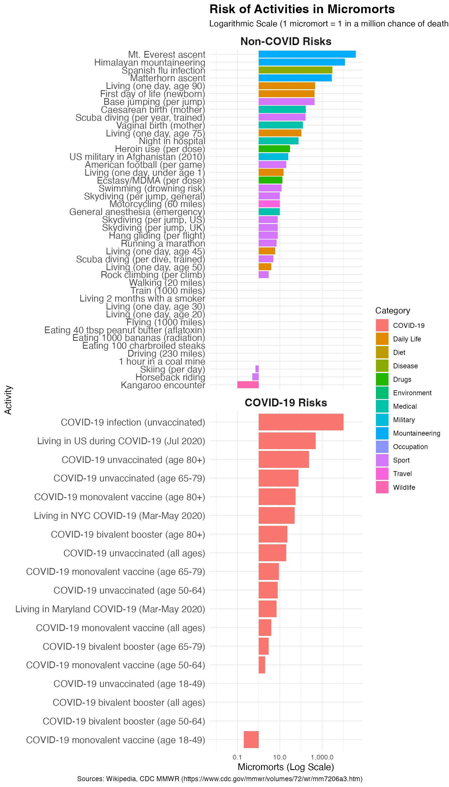

# Introduction to Micromorts and Risk Visualization

``` r
library(micromort)
library(ggplot2)
library(dplyr)
#> 
#> Attaching package: 'dplyr'
#> The following objects are masked from 'package:stats':
#> 
#>     filter, lag
#> The following objects are masked from 'package:base':
#> 
#>     intersect, setdiff, setequal, union
library(DT)
```

This vignette introduces the **micromort** package, which provides tools
for understanding and visualizing risks.

## 1. Micromorts (Acute Risk)

A **micromort** is a unit of risk representing a one-in-a-million chance
of death. It is used to measure acute risks—risks that can kill you
immediately (e.g., skydiving, driving).

``` r
# 1 in 10,000 chance of death = 100 micromorts
prob <- 1/10000
as_micromort(prob)
#> [1] 100

# Compare common risks (sortable table - click column headers)
risks <- common_risks()
DT::datatable(
  risks,
  caption = "Common risks in micromorts (click column headers to sort, use search box to filter)",
  filter = "top",
  options = list(pageLength = 10, scrollX = TRUE),
  rownames = FALSE
)
```

### Visualizing Risks

Using
[`plot_risks()`](https://johngavin.github.io/micromort/reference/plot_risks.md),
we can see the relative magnitude of different activities on a
logarithmic scale. The plot is split into COVID-19 and Other risks to
make comparisons easier:

``` r
# Default: faceted by COVID-19 vs Other
plot_risks()
```



#### Interactive Version

For interactive exploration with hover details and category filtering,
use
[`plot_risks_interactive()`](https://johngavin.github.io/micromort/reference/plot_risks_interactive.md):

``` r
# plotly version with dropdown filter and hover details
plot_risks_interactive()
#> Warning in RColorBrewer::brewer.pal(max(N, 3L), "Set2"): n too large, allowed maximum for palette Set2 is 8
#> Returning the palette you asked for with that many colors
#> Warning in RColorBrewer::brewer.pal(max(N, 3L), "Set2"): n too large, allowed maximum for palette Set2 is 8
#> Returning the palette you asked for with that many colors
```

## 2. Microlives (Chronic Risk)

While micromorts measure sudden death, **microlives** measure the impact
of chronic habits on your life expectancy. A microlife represents a
30-minute change in life expectancy.

Common chronic risks: \* Smoking 1 cigarette: -1 microlife (approx 1
micromort equivalent risk) \* Being 5kg overweight: -1 microlife per day
\* First 20 mins moderate exercise: +2 microlives

``` r
# as_microlife() converts minutes of life expectancy change to microlives
# Unit: 1 microlife = 30 minutes of life expectancy change PER DAY
# Sign: negative = loss, positive = gain

# Heavy smoker (20 cigarettes/day × 30 mins each = 600 mins LOST)
as_microlife(-20 * 30)  # = -20 microlives/day (life lost)
#> [1] -20

# Moderate exercise (20 mins exercise → 60 mins life GAINED)
as_microlife(60)        # = +2 microlives/day (life gained)
#> [1] 2

# Being 5kg overweight costs 30 mins per day
as_microlife(-30)       # = -1 microlife/day (life lost)
#> [1] -1

# Exercise can offset smoking:
# 2 cigarettes = -60 mins, 20 min exercise = +60 mins → net zero
as_microlife(-60) + as_microlife(60)  # = 0 (they cancel out)
#> [1] 0
```

## 3. Relationship Between Micromorts and Microlives

### Theoretical Conversion

Micromorts (acute, per-event risk) and microlives (chronic, per-day
attrition) measure different phenomena, but can be approximately
converted using expected value theory.

**Key relationship:** 1 micromort ≈ 0.7 microlives

**Assumptions for this conversion:** 1. Remaining life expectancy = 40
years (adjust for actual age) 2. Death occurs immediately upon the event
(worst case) 3. Linear approximation (valid for small probabilities)

**Mathematical derivation:**

``` r
# UNITS: 1 micromort = 1-in-a-million probability of IMMEDIATE DEATH per EVENT
# Question: What is the expected life lost from ONE micromort event?

remaining_years <- 40  # Assumed remaining life expectancy (years)
prob_death <- 1e-6     # 1 micromort = 1/1,000,000 death probability

# Expected life lost = probability × life forfeited if death occurs
# If the event kills you, you lose all remaining years
life_lost_years <- prob_death * remaining_years
cat("Expected life lost (years):", life_lost_years, "\n")
#> Expected life lost (years): 4e-05
cat("  = 1e-6 × 40 = 4e-5 years\n\n")
#>   = 1e-6 × 40 = 4e-5 years

# Convert years to minutes: 1 year = 365.25 × 24 × 60 = 525,960 minutes
life_lost_minutes <- life_lost_years * 365.25 * 24 * 60
cat("Expected life lost (minutes):", round(life_lost_minutes, 1), "\n")
#> Expected life lost (minutes): 21
cat("  = 4e-5 × 525,960 ≈ 21 minutes\n\n")
#>   = 4e-5 × 525,960 ≈ 21 minutes

# 1 microlife = 30 minutes of life expectancy change
# So 21 minutes ≈ 0.7 microlives
microlives_equivalent <- life_lost_minutes / 30
cat("Microlives equivalent:", round(microlives_equivalent, 2), "\n")
#> Microlives equivalent: 0.7
```

**Why
[`common_risks()`](https://johngavin.github.io/micromort/reference/common_risks.md)
uses microlives = micromorts × 0.7:**

The conversion allows comparing a single risky event (like one skydive
at 8 micromorts) to chronic daily habits (like smoking at -10
microlives/day). However, **the approximation breaks down when:**

1.  **Remaining life expectancy differs** from 40 years (a 20-year-old
    loses more per micromort than an 80-year-old)
2.  **The risk is not immediate death** (injuries, disabilities are not
    captured)
3.  **Repeated exposures** compound non-linearly

### Unit Definitions (Summary)

| Metric | Unit Definition | Scope | Sign |
|----|----|----|----|
| **Micromort** | 1-in-a-million probability of death | Per discrete event (1 surgery, 1 flight) | Always ≥ 0 |
| **Microlife** | 30 minutes of life expectancy change | Per day of exposure/habit | \+ = gain, − = loss |

### When to Use Each

- **Use micromorts** for discrete, short-duration events with binary
  outcomes (death or survival): surgery, skydiving, a single car trip
- **Use microlives** for chronic, daily habits that accumulate over a
  lifetime: smoking, exercise, diet
- **Convert between them** for policy decisions, but state your
  assumptions (age, remaining life expectancy)

## 4. Value of Statistical Life (VSL)

The **Value of a Statistical Life (VSL)** is the monetary value used to
justify safety spending. It is NOT the value of an individual life, but
the aggregate willingness to pay for small risk reductions.

Example: If a safety feature costs \$50 and saves 1 life in 100,000
people (10 micromorts), is it worth it? Cost per micromort saved = \$50
/ 10 = \$5. If VSL = \$10M, then 1 micromort = \$10. Since \$5 \< \$10,
it is cost-effective.

``` r
# Standard VSL of $10M implies $10 per micromort
value_of_micromort(vsl = 10000000)
#> [1] 10

# Higher VSL implies higher safety spending
value_of_micromort(vsl = 15000000)
#> [1] 15
```

## 5. Loss of Life Expectancy (LLE)

**LLE** estimates the average time lost from a lifespan due to a
specific risk. For a 1-in-a-million risk (1 micromort), the LLE is tiny.

``` r
# Loss of life expectancy from 1 micromort (assuming 40 years remaining)
lle_minutes <- lle(prob = 1/1e6, life_expectancy = 40)
print(lle_minutes)
#> [1] 21.0384
#> attr(,"class")
#> [1] "micromort_lle" "numeric"      
#> attr(,"units")
#> [1] "minutes"
# Result is in minutes. 1 micromort ~ 21 minutes lost?
# No, 1 micromort = 1e-6 * 40 years = 40e-6 years = ~21 minutes
# Wait, check calculation:
# 40 years * 365.25 days * 24 hours * 60 minutes = ~21 million minutes
# 1e-6 * 21 million = ~21 minutes
```

## 6. Complementary Metrics: QALY, DALY, and Morbidity

Micromorts and microlives focus on mortality. But many conditions (like
the common cold) cause significant quality of life loss without being
fatal. Complementary metrics capture this morbidity burden.

### QALY (Quality-Adjusted Life Year)

Measures years of life adjusted for quality. **1 QALY = 1 year of
perfect health.**

- Health states are weighted 0 (death) to 1 (perfect health)
- A year with chronic pain at 0.7 quality = 0.7 QALYs
- Used to assess cost-effectiveness of medical interventions (e.g.,
  £20,000-30,000 per QALY threshold in UK)

### DALY (Disability-Adjusted Life Years)

Measures disease burden as the sum of:

- **YLL (Years of Life Lost):** From premature mortality
- **YLD (Years Lived with Disability):** From morbidity, weighted by
  disability severity

**Formula:** `DALY = YLL + YLD`

For fatal diseases like COVID-19, YLL dominates. For non-fatal
conditions like the common cold, YLD dominates.

### Capturing Non-Fatal Burden: The “Microburden” Concept

The common cold doesn’t kill many people, but millions of work/school
days are lost annually. How do we capture this in a microlife-like
metric?

**Proposed “Microburden”:** Population-level quality of life lost per
million person-days.

``` r
# Example: Common cold burden calculation
# Disability weight for common cold: ~0.006 (WHO GBD)
# Average duration: 5-7 days
# Episodes per person per year: ~2-3

cold_disability_weight <- 0.006
cold_duration_days <- 6
episodes_per_year <- 2.5

# QALD (Quality-Adjusted Life Days) lost per episode
qald_per_episode <- cold_disability_weight * cold_duration_days

# Annual burden per person (in days of perfect health equivalent)
annual_burden_days <- qald_per_episode * episodes_per_year
cat("Annual quality burden (QALD/person):", round(annual_burden_days, 4), "\n")
#> Annual quality burden (QALD/person): 0.09

# For 1 million people
population <- 1e6
total_qald_lost <- annual_burden_days * population
cat("Population burden (QALD/million):", format(total_qald_lost, big.mark = ","), "\n")
#> Population burden (QALD/million): 90,000
```

### Comparing Metrics

| Metric | Unit Definition | Scope | Sign | Best For |
|----|----|----|----|----|
| **Micromort** | 1/1,000,000 death probability | Per discrete event (surgery, flight, climb) | ≥ 0 (probability) | Comparing single risky activities |
| **Microlife** | 30 min life expectancy change | Per day of chronic exposure | \+ gain / − loss | Daily lifestyle interventions |
| **QALY** | 1 year at perfect health (quality=1.0) | Per treatment/intervention | ≥ 0 | Cost-effectiveness in healthcare |
| **DALY** | 1 year lost to disease (YLL + YLD) | Per condition/population | ≥ 0 (burden) | Global health prioritization |
| **QALD** | 1 day at perfect health | Per illness episode | ≥ 0 | Short-term morbidity (colds, flu) |

### References

- WHO Global Burden of Disease:
  [ghdx.healthdata.org](https://ghdx.healthdata.org/)
- Spiegelhalter D (2012). BMJ 2012;345:e8223. <doi:10.1136/bmj.e8223>

## 7. Conditional Risks: Cancer, Vaccination, and Risk Hedging

### Cancer Risks by Type and Sex

The
[`cancer_risks()`](https://johngavin.github.io/micromort/reference/cancer_risks.md)
function provides mortality data stratified by cancer type, sex, and age
group:

``` r
# Top 3 cancers by mortality for each sex
cancer_risks() |>
  dplyr::filter(age_group == "All ages", sex != "Both") |>
  dplyr::group_by(sex) |>
  dplyr::slice_min(rank_by_sex, n = 3) |>
  dplyr::select(cancer_type, sex, deaths_per_100k, micromorts_per_year, family_history_rr) |>
  DT::datatable(
    caption = "Top 3 cancers by mortality rate (click to sort)",
    options = list(pageLength = 6, dom = "t"),
    rownames = FALSE
  )
```

**Family history impact:** The `family_history_rr` column shows relative
risk increase with a first-degree relative’s diagnosis. For example,
prostate cancer risk increases 2.5× with family history.

``` r
# Compare risk with vs without family history (male, age 50-64)
cancer_risks() |>
  dplyr::filter(sex == "Male", age_group == "50-64") |>
  dplyr::select(cancer_type, micromorts_per_year, micromorts_with_family_history) |>
  dplyr::mutate(
    increase_mm = micromorts_with_family_history - micromorts_per_year
  ) |>
  DT::datatable(
    caption = "Cancer risk with family history (Male, 50-64 years)",
    options = list(pageLength = 5, dom = "t"),
    rownames = FALSE
  )
```

### Vaccination Risk Reduction

The
[`vaccination_risks()`](https://johngavin.github.io/micromort/reference/vaccination_risks.md)
function quantifies micromorts avoided through vaccination:

``` r
# Childhood vaccination impact by country
vaccination_risks() |>
  dplyr::filter(age_group == "0-5", grepl("Complete", vaccine_schedule)) |>
  dplyr::select(country, mortality_reduction_pct, micromorts_avoided_per_year, annual_life_days_gained) |>
  DT::datatable(
    caption = "Complete childhood vaccination schedule impact",
    options = list(pageLength = 5, dom = "t"),
    rownames = FALSE
  )
```

``` r
# Adult vaccination benefits (age 65+)
vaccination_risks() |>
  dplyr::filter(age_group == "65+", country == "US") |>
  dplyr::select(vaccine_schedule, micromorts_avoided_per_year, microlives_gained_per_day) |>
  DT::datatable(
    caption = "Adult vaccination benefits (US, age 65+)",
    options = list(pageLength = 5, dom = "t"),
    rownames = FALSE
  )
```

### Hedged vs Unhedged: Optimal Lifestyle Comparison

The
[`conditional_risk()`](https://johngavin.github.io/micromort/reference/conditional_risk.md)
function compares risk factors between optimal (“hedged”) and suboptimal
(“unhedged”) states:

``` r
# Cardiovascular risk hedging
conditional_risk("cardiovascular") |>
  dplyr::select(risk_factor, unhedged_state, hedged_state, microlives_gained, annual_days_gained) |>
  DT::datatable(
    caption = "Cardiovascular hedging: microlives gained by optimal choices",
    options = list(pageLength = 10, scrollX = TRUE),
    rownames = FALSE
  )
```

### Total Portfolio Effect

The
[`hedged_portfolio()`](https://johngavin.github.io/micromort/reference/hedged_portfolio.md)
function calculates total life expectancy gain from adopting all optimal
lifestyle choices:

``` r
portfolio <- hedged_portfolio()

# Summary by disease category
portfolio$by_category |>
  DT::datatable(
    caption = "Microlives gained by disease category",
    options = list(pageLength = 5, dom = "t"),
    rownames = FALSE
  )
```

``` r
# Overall portfolio impact
portfolio$portfolio_summary |>
  DT::datatable(
    caption = "Total hedged portfolio effect",
    options = list(pageLength = 6, dom = "t"),
    rownames = FALSE
  )
```

**Interpretation:** A fully “hedged” individual (non-smoker, regular
exercise, healthy diet, vaccinated, etc.) can expect to gain
approximately 1.3444^{4} days of life expectancy over 40 years compared
to an “unhedged” baseline.

## 8. Conclusion

The `micromort` package helps translate abstract probabilities into
concrete units for better decision-making. By comparing acute risks
(micromorts), chronic risks (microlives), and quality-of-life metrics
(QALYs, DALYs), individuals and policymakers can make more informed
choices about risk trade-offs.

The new conditional risk functions enable:

- **Cancer risk assessment:** Compare baseline risk to family history
  scenarios
- **Vaccination value:** Quantify micromorts avoided through vaccination
  schedules
- **Lifestyle optimization:** Calculate total life expectancy gain from
  adopting optimal “hedged” behaviors
