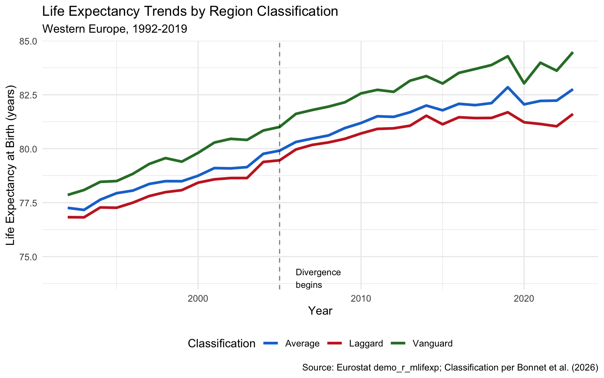

# Regional Variation in Life Expectancy

This vignette explores **regional variation in life expectancy** across
Western Europe, based on research by Bonnet et al. (2026) published in
*Nature Communications*.

## Understanding the Data Structure

**Each row represents aggregated population statistics for one
region-year-sex combination**, NOT individual survey responses.

| region_code | year | sex | life_expectancy | What this means |
|----|----|----|----|----|
| FR10 | 2019 | Male | 82.5 | Average LE for **all males** in Île-de-France in 2019 |
| FR10 | 2019 | Female | 87.1 | Average LE for **all females** in Île-de-France in 2019 |
| FR10 | 2019 | Total | 84.8 | Average LE for **entire population** of Île-de-France in 2019 |

The underlying Eurostat data represents **~400 million people** across
Western Europe. Life expectancy is calculated from official death
registrations and census population counts—not a sample survey.

**Row count formula:** `regions × years × 3 sex categories`

- Sample data: 11 regions × 28 years × 3 = **924 rows**
- Full dataset: 450 regions × 28 years × 3 = **37,800 rows**

## Key Finding: A Two-Tiered Europe

Since the mid-2000s, Western Europe has fragmented into: - **Vanguard
regions**: Continued progress (~2.5 months/year gain for men) -
**Laggard regions**: Stalled improvement (\<0.5 months/year gain)

This divergence reversed decades of convergence observed in the 1990s.

## The Microlives Gap

The ~7 year gap between vanguard and laggard regions translates to a
substantial lifetime difference in microlives:

    #> Life expectancy gap: 2.6 years
    #> Lifetime microlives difference: 45,496
    #> Daily microlives difference: 3.1 per day

**Interpretation:** Living in a vanguard region vs a laggard region
corresponds to ~3.1 microlives per day—roughly equivalent to the benefit
of 30 minutes of daily exercise.

## Regional Data Explorer

**Data period:** 2019 (pre-COVID baseline year, last year before
pandemic distortions)

**Column definitions:**

| Column | Definition | Units |
|----|----|----|
| `region_name` | NUTS2 administrative region | — |
| `country_code` | ISO 2-letter country code | — |
| `life_expectancy` | Period life expectancy at birth | Years |
| `microlives_vs_eu_avg` | Daily microlives gained/lost vs EU average | Microlives/day |
| `classification` | Vanguard (top 20% + growing), Laggard (bottom 20% or stagnant), Average | — |

**Key findings:**

- **Vanguard-laggard gap:** ~7 years LE difference = **~8.4
  microlives/day** (equivalent to 30 min daily exercise)
- **Gap trend:** Widened from ~5 years (1992) to ~7 years (2019) as
  laggard regions stagnated post-2005
- **Top region:** Comunidad de Madrid (ES) at 86.1 years
- **Bottom region:** Mayotte (FR overseas) at 74.9 years
- **Microlives interpretation:** +1.0 microlives/day ≈ +30 min life
  expectancy/day ≈ +7.6 days/year

## Trends Over Time

The divergence became pronounced after 2005:

## Mortality Risk Multiplier

Use
[`regional_mortality_multiplier()`](https://johngavin.github.io/micromort/reference/regional_mortality_multiplier.md)
to adjust baseline micromort estimates by location:

**Application:** If the baseline risk for an activity is 10 micromorts,
the location-adjusted risk in Paris would be approximately
`10 × 0.93 = 9.3 micromorts` (7% lower due to favorable regional
factors).

## Ecological Fallacy Warning

**IMPORTANT:** These regional statistics reflect population averages,
not individual-level causation.

High life expectancy in “vanguard” regions results from multiple
interacting factors:

| Factor | Mechanism |
|----|----|
| Healthcare access | Better hospitals, preventive care |
| Socioeconomic composition | Higher income, education levels |
| Selection effects | Healthy/wealthy people move to desirable regions |
| Historical factors | Long-term infrastructure investments |
| Cultural factors | Diet, social cohesion, lifestyle norms |

**Moving to Switzerland will NOT automatically extend your life.** The
regional advantage reflects the aggregate characteristics of people who
already live there.

## Data Source

The regional classification methodology follows Bonnet et al. (2026):

> Bonnet F, et al. “Potential and challenges for sustainable progress in
> human longevity.” *Nature Communications* 17, 996 (2026).
> [doi:10.1038/s41467-026-68828-z](https://doi.org/10.1038/s41467-026-68828-z)

Raw data from Eurostat `demo_r_mlifexp` dataset. Interactive exploration
available at the [ReLoG_Europe
tool](https://histdemo.shinyapps.io/ReLoG_Europe/).

## Functions Reference

| Function | Purpose |
|----|----|
| [`regional_life_expectancy()`](https://johngavin.github.io/micromort/reference/regional_life_expectancy.md) | Full dataset with filters |
| [`vanguard_regions()`](https://johngavin.github.io/micromort/reference/vanguard_regions.md) | Top-performing regions only |
| [`laggard_regions()`](https://johngavin.github.io/micromort/reference/laggard_regions.md) | Stagnating regions only |
| [`regional_mortality_multiplier()`](https://johngavin.github.io/micromort/reference/regional_mortality_multiplier.md) | Location-based risk adjustment |
